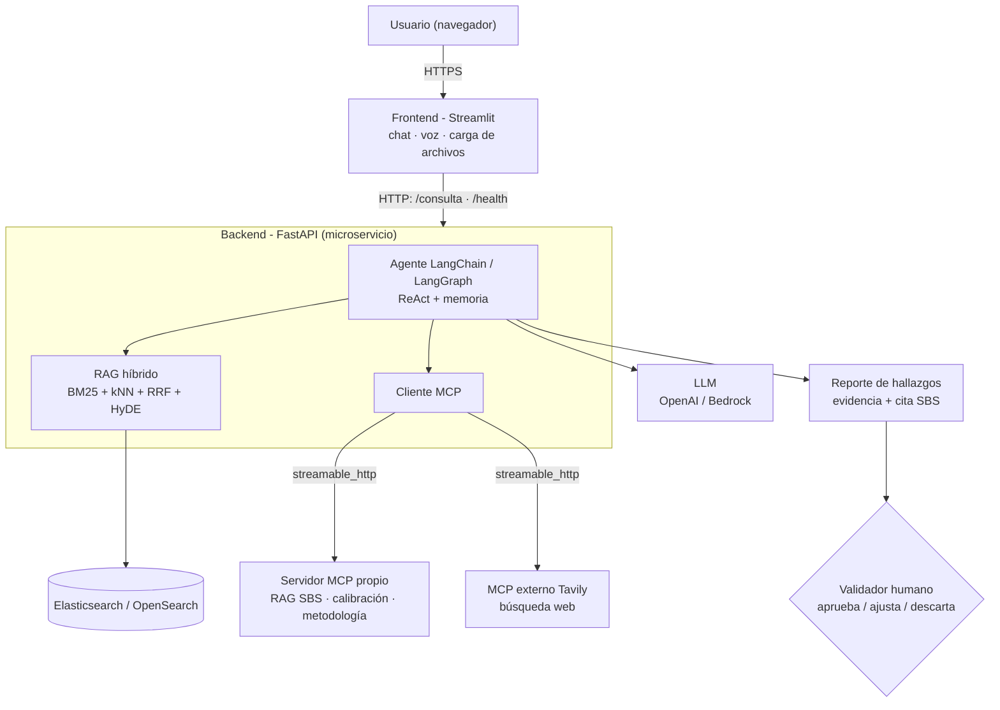

# ValidAI Risk — Copiloto de Validación de Modelos de Riesgo de Crédito

Solución end-to-end de IA Generativa (LangChain + RAG + MCP) que asiste al validador de modelos de **probabilidad de incumplimiento (PD)** en banca, alineada a normativa **SBS**. Frontend y backend separados, servidor MCP independiente.

## Caso de negocio

La validación de modelos PD es un proceso manual y repetitivo: replicar el modelo, correr tests, contrastar contra normativa y redactar hallazgos. ValidAI Risk lo convierte en un **copiloto**: el validador consulta desde una interfaz web y el agente ejecuta las pruebas, cita la normativa y propone hallazgos. La **decisión final es humana** (aprueba, ajusta o descarta).

- **Usuario objetivo:** analista de validación de modelos de riesgo de crédito.
- **Valor:** reduce el tiempo de validación y estandariza la evidencia; todo resultado proviene de una herramienta (trazable), nada se inventa.
- **Fuera de alcance (v1):** otros riesgos (mercado, operacional); auto-mejora normativa (queda como Fase 2, con límite de diseño).

## Arquitectura

```
Usuario → Frontend (Streamlit) → Backend API (FastAPI)
                                     ├── LangChain / LangGraph (agente ReAct + memoria)
                                     ├── RAG (Elasticsearch/OpenSearch, híbrido + HyDE, con fuentes)
                                     └── Cliente MCP → Servidor MCP (tools de validación)
```

El frontend **no** ejecuta el agente ni el RAG ni el MCP: solo consume la API del backend por HTTP.

Diagrama del flujo (ver también `docs/arquitectura.mermaid`):



### Relación entre módulos

- **M2 (LangChain):** agente ReAct (`create_react_agent`) con tools, prompt de dominio y memoria conversacional por `thread_id`.
- **M4 (RAG):** pipeline híbrido (BM25 + kNN + RRF) con HyDE sobre Elasticsearch/OpenSearch; respuestas con fuentes.
- **M6 (MCP):** servidor MCP independiente con 3 capacidades; el backend actúa como **cliente MCP** (descubrimiento e invocación reales).
- **M3 (LangGraph, opcional):** el agente usa `create_react_agent` de LangGraph con checkpointer (estado/memoria); HITL en la aprobación de hallazgos.

## Componentes y pruebas de validación (rol validador)

- **Metodológica** (`validacion_metodologica.py`): IV/WoE + monotonía, VIF, coherencia de signos, estabilidad PSI/CSI y benchmark contra un challenger logístico.
- **Calibración** (`calibracion.py`): binomial, Jeffreys, semáforo por grado, Hosmer-Lemeshow, Spiegelhalter Z, calibration-in-the-large.
- **Replicación Modo B** (`copiloto_auto.py`): recalcula la PD desde la data cruda + especificación (conector Athena).
- **Normativa SBS** (RAG): cita la resolución/artículo que respalda cada criterio.

## Tecnologías y requisitos

Python 3.11, FastAPI, Streamlit, LangChain/LangGraph, Elasticsearch (u OpenSearch), OpenAI (o Amazon Bedrock), FastMCP. Docker y Docker Compose para ejecución local.

## Variables de entorno

Ver `.env.example` en la raíz y en cada servicio. Copiar a `.env` y completar (nunca subir secretos):

- `LLM_PROVIDER` = `openai` (curso) o `bedrock` (trabajo AWS)
- `OPENAI_API_KEY`, `OPENAI_MODEL` (o `AWS_REGION`, `BEDROCK_MODEL_ID`)
- `ELASTIC_URL`, `ELASTIC_API_KEY`
- `VALIDAIRISK_MCP_URL` (URL del servidor MCP; en compose se inyecta automáticamente)
- `BACKEND_URL` (frontend → backend)

## Ejecutar (local, con Docker Compose)

```bash
cp .env.example .env      # completar credenciales
docker compose up --build
# Frontend:  http://localhost:8501
# Backend:   http://localhost:8000/health
# MCP:       http://localhost:8080
```

### Ejecutar sin Docker (desarrollo)

```bash
# Backend
cd backend && pip install -r requirements.txt && uvicorn main:app --port 8000
# Frontend (otra terminal)
cd frontend && pip install -r requirements.txt && streamlit run app.py
```

## Contrato de la API (backend)

- `GET /health` → `{"status": "ok"}`
- `POST /consulta` → body `{"pregunta": "...", "session_id": "opcional"}`
  respuesta `{"session_id": "...", "respuesta": "...", "trazas": [{"tool": "...", "contenido": "..."}]}`

Ejemplo:

```bash
curl -X POST http://localhost:8000/consulta \
  -H "Content-Type: application/json" \
  -d '{"pregunta": "¿Qué Gini mínimo exige la SBS?"}'
```

## Tools/Resources MCP

El cliente MCP del backend conecta a **dos** servidores:

**1. `validairisk`** (servidor propio, FastMCP), 3 tools:

- `buscar_evidencia_rag(pregunta)` — evidencia normativa SBS (RAG).
- `calcular_calibracion(ruta_datos)` — informe de calibración de PD.
- `validar_metodologia(ruta_datos, especificacion_json)` — validación metodológica.

**2. `tavily`** (MCP externo público de búsqueda web): permite agregar una fuente externa verificable al reporte. Se activa con `TAVILY_API_KEY`. Endpoint: `https://mcp.tavily.com/mcp/`.

Prueba local: `python mcp-server/mcp_server.py --stdio` y un cliente MCP que liste/llame las tools.

## Índice RAG (reconstrucción)

La base de conocimiento (documentos SBS/metodológicos) se indexa en Elasticsearch/OpenSearch (`validairisk_hybrid`). Ver `data/` y el pipeline de ingesta del notebook `ValidAIRisk_M4_MCP_6.ipynb`.

## Pruebas

- Unitaria: `backend/tests/test_metodologia.py` (reglas de negocio del módulo metodológico).
- Smoke: `backend/tests/test_api.py` (endpoint `/health` y contrato de `/consulta`).

```bash
cd backend && pytest -q
```

## Despliegue en AWS (trabajo)

Mismo código, cambiando configuración: `LLM_PROVIDER=bedrock` (Claude vía Bedrock), Elasticsearch → **Amazon OpenSearch**, datos vía **Athena** (`copiloto_auto`/`validacion_metodologica` ya usan `awswrangler`), contenedores en **App Runner / ECS Fargate**, secretos en **Secrets Manager**, memoria de hallazgos en **DynamoDB**. Ver `docs/` (rediseño AWS).

## URLs desplegadas

- Frontend: _(completar tras el despliegue)_
- Backend `/health`: _(completar)_
- MCP: _(completar)_

## Limitaciones y mejoras futuras

- v1 cubre validación metodológica y de calibración; implementación y periódica quedan en roadmap.
- Sin auto-mejora normativa (límite de diseño; human-in-the-loop obligatorio).
- **Tamaño de documentos subidos:** hoy el documento/código subido se inyecta al prompt y
  se trunca a ~10.000 caracteres (`MAX_CONTEXT_CHARS`) — simplificación consciente del MVP.
  Para documentos grandes (PDFs extensos), la mejora es aplicar el **mismo pipeline RAG**
  al documento del caso: fragmentar (chunking + overlap), indexar y recuperar solo los
  fragmentos relevantes por consulta, de modo que el tamaño del documento deje de ser una
  restricción. Alternativas: subir `MAX_CONTEXT_CHARS`, resumen map-reduce por secciones,
  o un modelo de contexto grande (p. ej. gpt-4o 128k). La infraestructura RAG ya existe,
  por lo que es una extensión natural.
